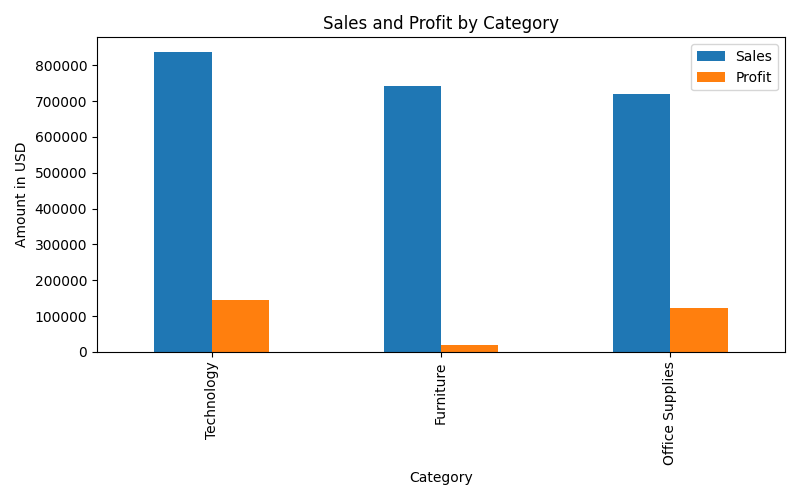
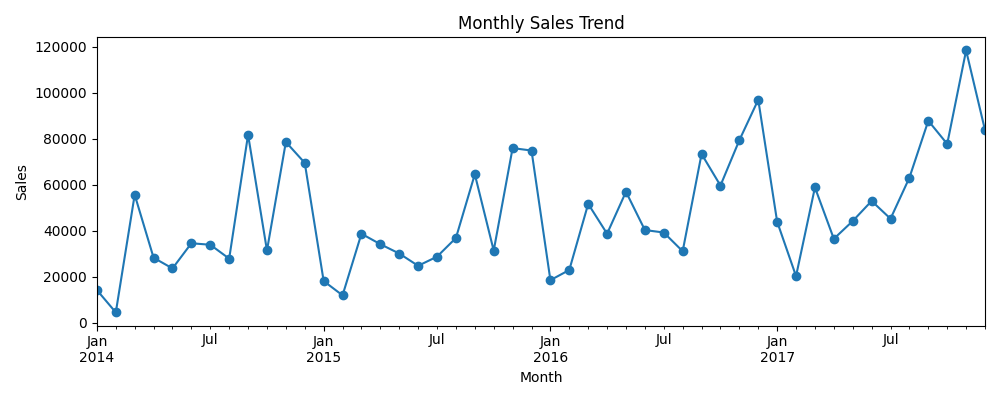
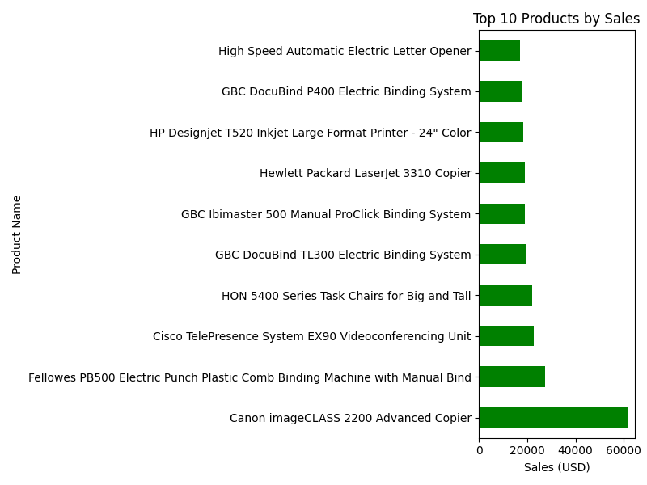
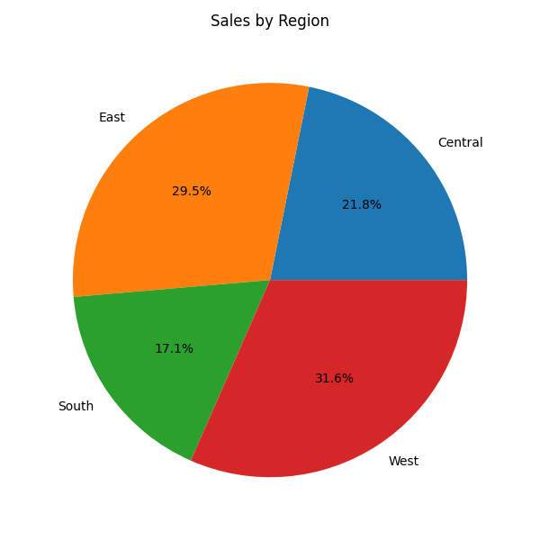

# 💼 Sales Dashboard Analysis

An exploratory data analysis project using **Python** to uncover key business insights from a retail superstore's sales data. This project visualizes sales, profit trends, and customer behavior using various dimensions such as category, region, and time.

---

## 📊 Project Highlights

- Analyzed **10,000+ records** of order, customer, and sales data
- Identified **top-performing products, categories, and regions**
- Created **monthly sales trend visualizations**
- Exported visualizations and saved them for reporting
- Tools: `pandas`, `matplotlib`, `seaborn`, Jupyter Notebook

---

## 📁 Dataset

- Source: [Sample Superstore Dataset on Kaggle](https://www.kaggle.com/datasets/vivek468/superstore-dataset-final)
- Data columns include:
  - `Order Date`, `Sales`, `Profit`, `Region`, `Category`, `Segment`, `Product Name`, `Discount`, etc.

---

## 🧰 Technologies Used

- Python
- Jupyter Notebook
- pandas
- matplotlib
- seaborn

---

## 📷 Sample Visualizations

> 📊 Sales and Profit by Category  
> 

> 📈 Monthly Sales Trend  
> 

> 🛍️ Top Products by Sales  
> 

> 🌎 Sales by Region  
> 

---

## 🚀 How to Run This Project

1. Clone this repository:
   ```bash
   git clone https://github.com/YOUR_USERNAME/sales-dashboard.git
   cd sales-dashboard

2. Install dependencies
   pip install pandas matplotlib seaborn

3. Run the notebook
   jupyter notebook notebooks/sales_dashboard.ipynb

4. Ensure the dataset(SampleSuperstore.csv) is placed in the data/ folder

## ✅ Key Insights
- Technology was the most profitable category, but Furniture had inconsistent returns.

- Western and Eastern regions performed well in terms of sales volume.

- Some high-sales products showed low profitability due to discounts.

## 📈 Potential Improvements
- Add a Streamlit dashboard for interactive exploration

- Build predictive models for future sales forecasting

- Merge with customer satisfaction data (if available)

## 📄 License
This project is open-source and available under the MIT License.